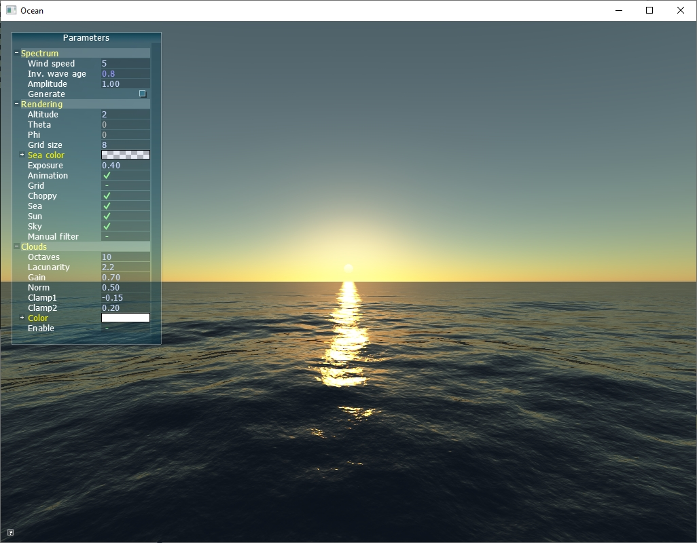
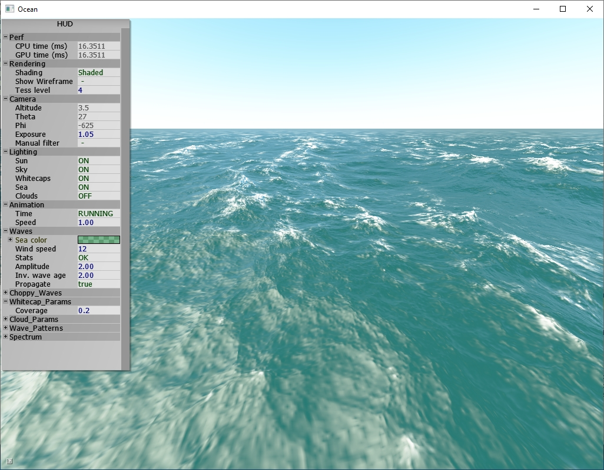
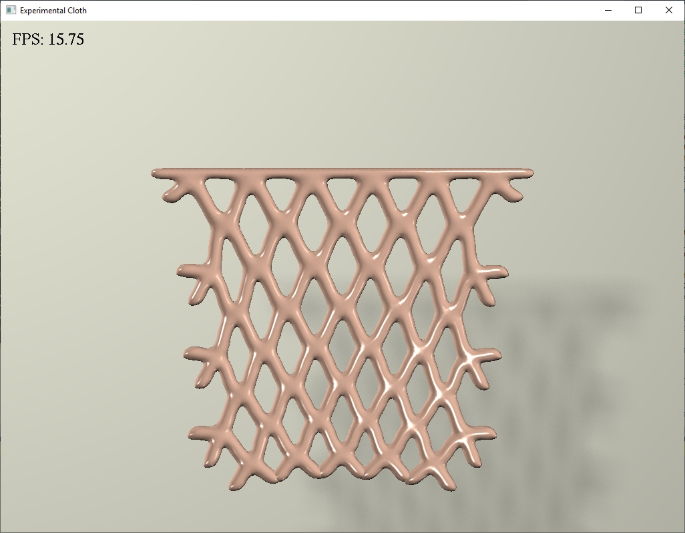
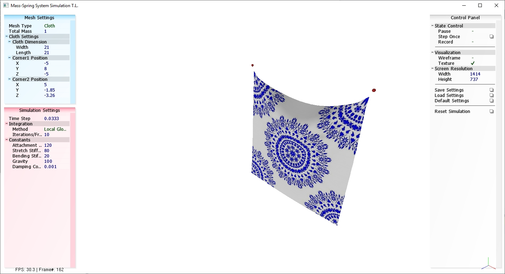

# Daedalus Playground
Collection of open source OpenGL demos, graphics prototypes and physics sims. The goal was to gather cool looking projects, wrap them around with a tiny and dumb CMake environment and make them run on Windows/Ubuntu. Follow the links to find the authors' original code drop and research. Thank you for releasing your work and source code into the wild!

### Real-time Realistic Ocean Lighting - [Project site](http://evasion.imag.fr/Membres/Eric.Bruneton/)
<p align="center"></p>
<p>**Abstract:** Realistic animation and rendering of the ocean is an important aspect for simulators, movies and video games. By nature, the ocean is a difficult problem for Computer Graphics: it is a dynamic system, it combines wave trains at all scales, ranging from kilometric to millimetric. Worse, the ocean is usually viewed at several distances, from very close to the viewpoint to the horizon, increasing the multi-scale issue, and resulting in aliasing problems. The illumination comes from natural light sources (the Sun and the sky dome), is also dynamic, and often underlines the aliasing issues. In this paper, we present a new algorithm for modelling, animation, illumination and rendering of the ocean, in real-time, at all scales and for all viewing distances. Our algorithm is based on a hierarchical representation, combining geometry, normals and BRDF. For each viewing distance, we compute a simplified version of the geometry, and encode the missing details into the normal and the BRDF, depending on the level of detail required. We then use this hierarchical representation for illumination and rendering. Our algorithm runs in real-time, and produces highly realistic pictures and animations.</p>

### Real-time Animation and Rendering of Ocean Whitecaps - [Project site](https://hal.inria.fr/hal-00967078/)
<p align="center"></p>
<p>**Abstract:** We present a scalable method to procedurally animate and render vast ocean scenes with whitecaps on the GPU. The whitecap coverage on the ocean surface is determined using a wave deformation criteria which can be pre-filtered linearly. This allows us to take advantage of the fast mip-mapping and texture filtering capabilities of modern hardware and produce plausible and anti-aliased images for scales ranging from centimetric to planetary in real time.</p>

### A Chebyshev Semi-Iterative Approach for Accelerating Projective and Position-Based Dynamics (Windows only) - [Project site](http://web.cse.ohio-state.edu/~wang.3602/publications.html)
<p align="center"></p>
<p>**Abstract:** In this paper, we study the use of the Chebyshev semi-iterative approach in projective and position-based dynamics. Although projective dynamics is fundamentally nonlinear, its convergence behavior is similar to that of an iterative method solving a linear system. Because of that, we can estimate the “spectral radius” and use it in the Chebyshev approach to accelerate the convergence by at least one order of magnitude, when the global step is handled by the direct solver, the Jacobi solver, or even the Gauss-Seidel solver. Our experiment shows that the combination of the Chebyshev approach and the direct solver runs fastest on CPU, while the combination of the Chebyshev approach and the Jacobi solver outperforms any other combination on GPU, as it is highly compatible with parallel computing. Our experiment further shows position-based dynamics can be accelerated by the Chebyshev approach as well, although the effect is less obvious for tetrahedral meshes. The whole approach is simple, fast, effective, GPU-friendly, and has a small memory cost.</p>

### Fast Simulation of Mass-Spring Systems - [Project site](https://www.cs.utah.edu/~ladislav/liu13fast/liu13fast.html)
<p align="center"></p>
<p>**Abstract:** We describe a scheme for time integration of mass-spring systems that makes use of a solver based on block coordinate descent. This scheme provides a fast solution for classical linear (Hookean) springs. We express the widely used implicit Euler method as an energy minimization problem and introduce spring directions as auxiliary unknown variables. The system is globally linear in the node positions, and the non-linear terms involving the directions are strictly local. Because the global linear system does not depend on run-time state, the matrix can be pre-factored, allowing for very fast iterations. Our method converges to the same final result as would be obtained by solving the standard form of implicit Euler using Newton's method. Although the asymptotic convergence of Newton's method is faster than ours, the initial ratio of work to error reduction with our method is much faster than Newton's. For real-time visual applications, where speed and stability are more important than precision, we obtain visually acceptable results at a total cost per timestep that is only a fraction of that required for a single Newton iteration. When higher accuracy is required, our algorithm can be used to compute a good starting point for subsequent Newton's iteration.</p>

## Compile and build
```
git clone https://github.com/Woking-34/daedalus-playground.git
cd daedalus-playground
mkdir _build
cd _build
cmake .. -G"Visual Studio 15 2017 Win64"
cmake --build . --target bruneton_ocean --config Release
cmake --build . --target dupuy_whitecaps --config Release
...
```
